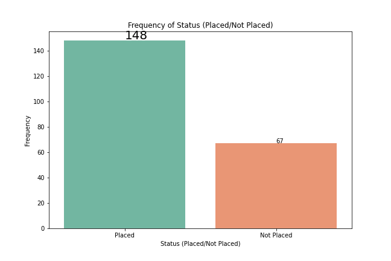
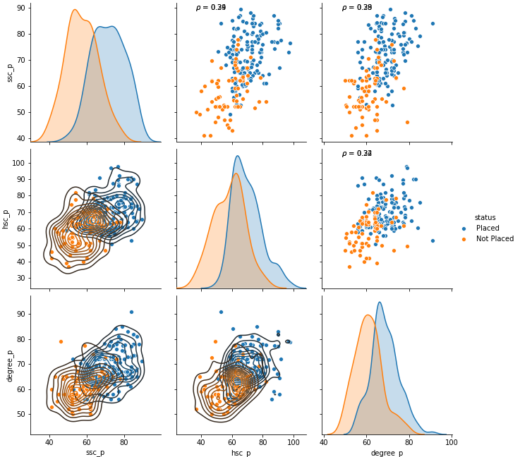
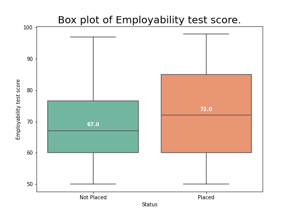

# CAMPUS RECRUITMENT PROJECT
---

## Introduction
There are so many factors affect the placements of a student for a job. In this project I am trying to understand some of those factors which recruiters consider important. I have also created a machine learning algorithm which classifies the students who have a high chance of getting placed from those who won’t.

## Data
The data set consists of Placement details of students in XYZ campus. It includes secondary and higher secondary percentage and specialization. It also includes degree percentage, degree specialization, MBA percentage, MBA specialization, work experience if any and the salary offered to those who got placed. The target variable is status, which contains two classes – ‘Placed’ and ‘Not Placed’.
```text
Placement_Data_Full_Class.csv
```
## Software
The programming language used for this project is Python. Python is a general-purpose programming language with lots of libraries which are very useful for data analysis and machine learning projects. The python version used for this project is `python 3.8.3.`

The major libraries used for this project are:
1.	NumPy
2.	Pandas
3.	Matplotlib
4.	Seaborn
5.	SciPy
6.	Scikit-learn

## Understanding the Data
In this dataset, there is only one column which contains missing values, which is the ‘salary’ column. There are 67 missing values in salary column. If a student does not get placed, then he/she won’t have a salary package, hence all 67 students without any values for salary are those who are not placed.

148 students out of 215 got placements and 67 were not placed. 


```python
# Code for countplot
plt.figure(figsize=(9,6))
ax = sns.countplot(df.status, palette='Set2')

ax.annotate(ax.patches[0].get_height(),(-0.09,149))
ax.annotate(ax.patches[1].get_height(),(1,69))

plt.title('Frequency of Status (Placed/Not Placed)')
plt.xlabel('Status (Placed/Not Placed)')
plt.ylabel('Frequency')

plt.savefig('plots/Countplot_of_status.png')
```


## Findings from the Data
 ### * Does the 10th, 12th and degree marks determine the chances of a student getting placed?
---
  

  ```python
  # Code for Pairplot
  def corr(x, y, **kwargs):
    
    # Calculate the value
    coef = np.corrcoef(x, y)[0][1]
    # Make the label
    label = r'$\rho$ = ' + str(round(coef,2))
    # Add the label to the plot
    ax = plt.gca()
    ax.annotate(label, xy = (0.15, 0.95), size = 10, xycoords = ax.transAxes)


grid = sns.pairplot(df[['ssc_p', 'hsc_p','degree_p', 'status']], hue='status', size=3)
grid.map_upper(corr)
grid.map_lower(sns.kdeplot)

plt.suptitle(t='Pairplot of 10th, 12th and degree marks with Placement status', x=0.5, y=1.05, size=20)
plt.savefig('plots/Pairplot_of_marks_status.png')
  ```
Figure shows the pair plot of 10th, 12th and degree marks which are categorized by status. The orange dots represent Not Placed and the blue dot represent placement. If the 10th, 12th and degree marks are low, then we can see more orange dots, that means these students were not placed, and those students who performed well in these exams were successful in securing the placements. So, the marks scored by a student in 10th, 12th and degree is a significant factor in securing the placements. But we can also see outliers in both the categories.

### * Does having a work experience improve the odds of getting placed?
---
If the student doesn't have a work experience, then he/she has only 59.5% chance of getting placed, but if he/she have work experience then the odds of getting placed increases to 86.4%.

### * Does the marks from Employability test conducted by the college impacted the odds of getting placed?
---


```python
# Code for boxplot
plt.figure(figsize=(8,6))
bp = sns.boxplot(x='status', y='etest_p', data=df, palette='Set2', order=['Not Placed', 'Placed'])

medians = df.groupby(['status'])['etest_p'].median()
vertical_offset = df['etest_p'].median() * 0.02 # offset from median for display

for xtick in bp.get_xticks():
    bp.text(xtick,medians[xtick] + vertical_offset, medians[xtick], 
            horizontalalignment='center',fontsize=10,color='w',weight='semibold')

plt.title('Box plot of Employability test score.', size=20)
plt.ylabel('Employability test score')
plt.xlabel('Status')
plt.savefig('plots/Box_of_etest_p.png')
plt.show()
```

From the boxplot we can see that, students who got placements have a median mark of 72%, but those who were not placed got a median score of 67%. So, the employment score has an impact on placements.

### * Is there a particular branch in MBA which offers good placement results?
---
If the specialization is Marketing and Finance, then the student has a 79.17% chance of getting placed, whereas there is only 55.79% chance for students who specialized in Marketing and HR. 

## Exploration Results
After the exploratory data analysis, all the unnecessary variables are removed from the dataset and only the necessary variables are used for model building. From 13 independent variables I selected only 5 variables for my final model.
The selected variables are: 
1.	10th percentage
2.	12th percentage
3.	Degree percentage
4.	Work experience
5.	MBA specialization

## Conclusion
Based on the model comparison overall accuracy is higher for Random Forest Classifier which is 80% accuracy. All the other model having the overall accuracy at 75.38%. But the accuracy of classifying the negative class (accuracy of 0’s) are almost equal for all the models which is 72.72% accuracy.
Overall, we can select Random Forest Classifier to classify this data, as it performs well on most evaluation metrics.

## Reference
1.	https://www.kaggle.com/benroshan/factors-affecting-campus-placement
2.	https://www.geeksforgeeks.org/countplot-using-seaborn-in-python/#:~:text=countplot()%20method%20is%20used,each%20categorical%20bin%20using%20bars.&text=Parameters%20%3A%20This%20method%20is%20accepting,for%20plotting%20long%2Dform%20data.
3.	https://towardsdatascience.com/visualizing-data-with-pair-plots-in-python-f228cf529166
4.	https://www.datacamp.com/community/tutorials/pandas-to-csv?utm_source=adwords_ppc&utm_campaignid=1455363063&utm_adgroupid=65083631748&utm_device=c&utm_keyword=&utm_matchtype=b&utm_network=g&utm_adpostion=&utm_creative=332602034358&utm_targetid=aud-299261629574:dsa-429603003980&utm_loc_interest_ms=&utm_loc_physical_ms=1007779&gclid=CjwKCAjwkN6EBhBNEiwADVfyazLgCCdlDA8GBMOyS5aOcdDjPVN28ULMXZIjXjmmq9HKyrXk_YL0KxoCrg4QAvD_BwE
5.	https://www.python-graph-gallery.com/35-control-order-of-boxplot 
